# Description of all options
Option 1 is streamlining ssh configuration. In option 1, I will use the configuration file for ssh to save some time logging into my course specific account. First I created a `~/.ssh/config` file, modified the file to containing the following lines: `Host ieng6` `HostName ieng6.ucsd.edu` `User cs15lsp22zzz (use your username)`. By modifying the ssh configuration file, it tells SSH what username to use when logging into specific servers, which saves me more time and I don't need to type `$ ssh cs15lsp22zzz@ieng6.ucsd.edu` every time to log in. Also, I will use an scp command to copy a file to my account.

Option 2 is set up Github access from ieng6. In option 2, I will create a public key, private key, and store them appropriately. I will store my public key in Github. I will run `git` commands from the command line to commit and push a change to Github while I am logged into my ieng6 account.

Option 3 is copy whole directories with `scp -r`. In option 3, I will use `scp -r` to copy my whole markdown-parse directory to my ieng6 account. After that, I will compile and run tests for my repository. Lastly, I will combine multiple commands to copy the whole directory and run the tests in one line.

# Streamlining ssh Configuration
### 1. Showing my `.ssh/config` file
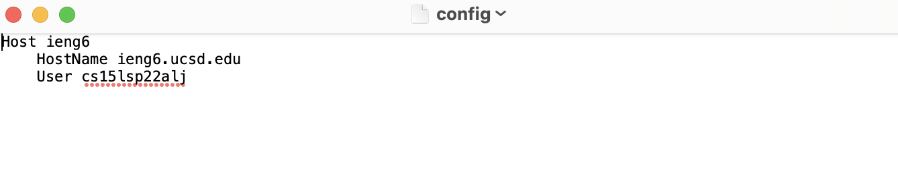

### 2. Showing the `ssh` command that logged me into my account
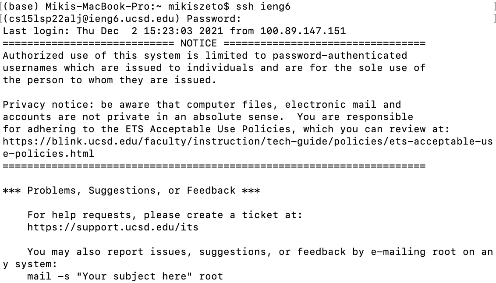
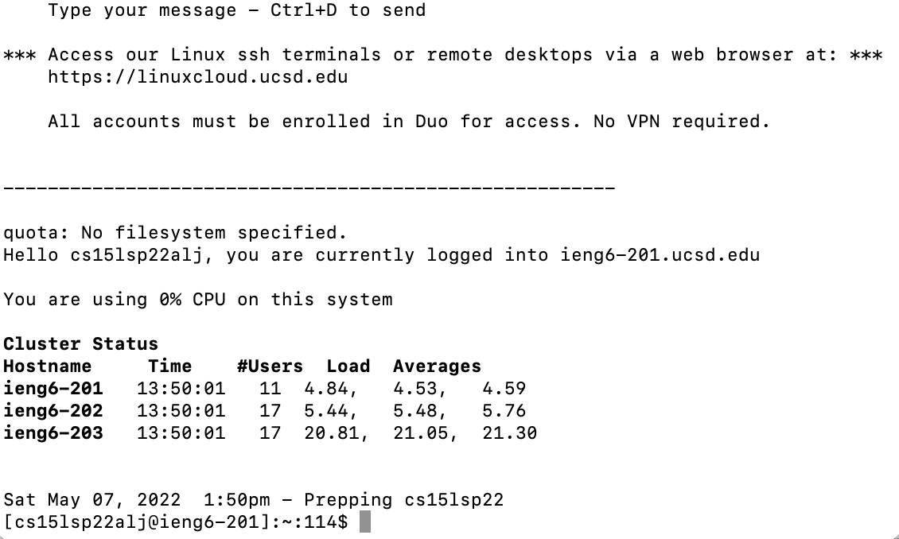

### 3. Showing the `scp` command
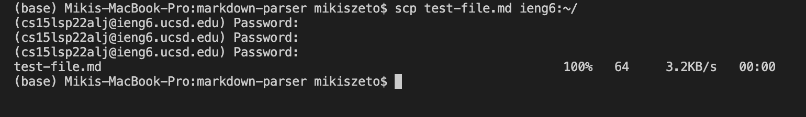

# Setup Github Access from ieng6
### 1. Showing where the public key is stored
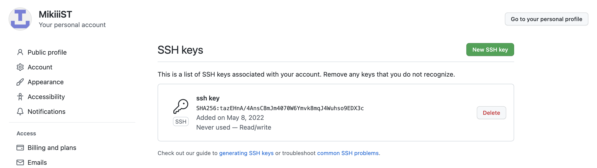
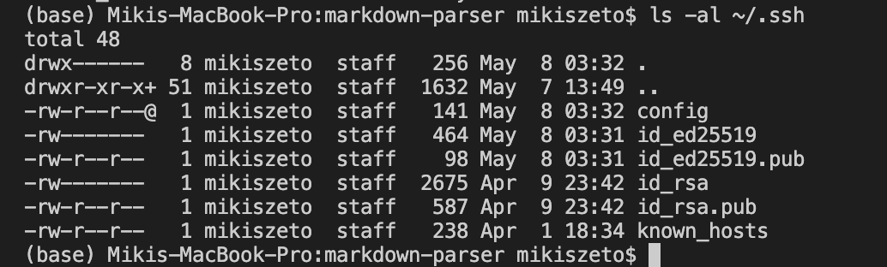

### 2. Showing where the private key is stored

 
### 3. Running git commands to commit and push
 `git commit`:
 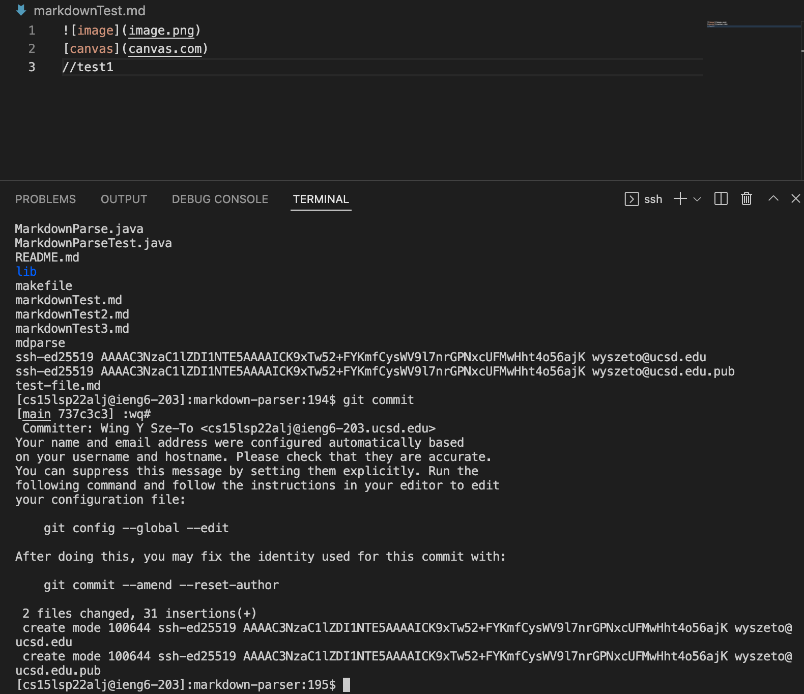
 `git push`:
 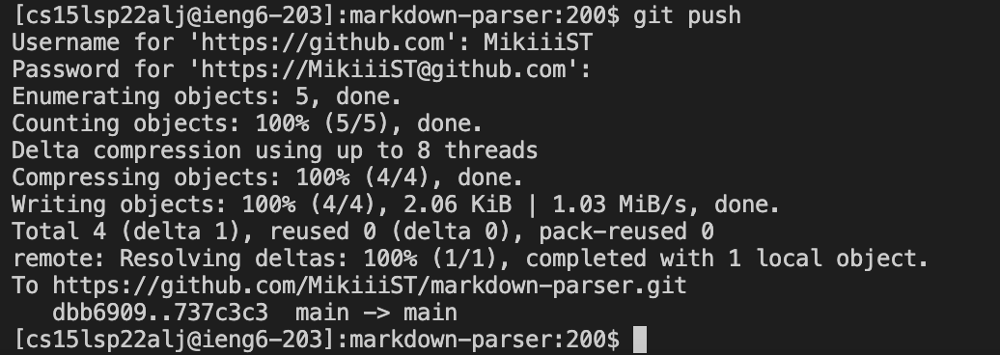
 
### 4. A link for the resulting commit
Please click [here](https://github.com/MikiiiST/markdown-parser/commit/fc2ac00a23baf867e3cdb0c9cf6324e942bcd6b4)

# Copy whole directories with scp -r
### 1. Show copying the whole markdown-parse directory to ieng6 account
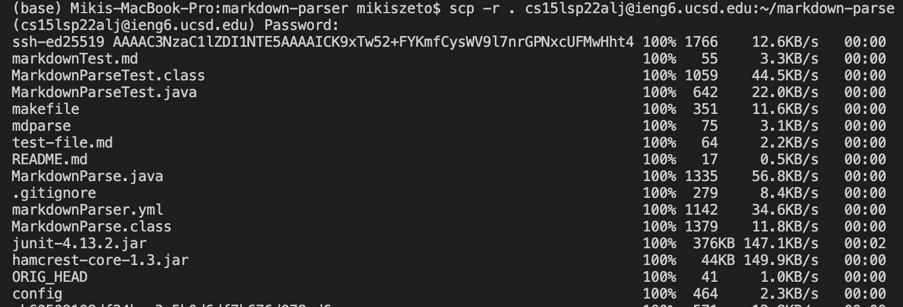
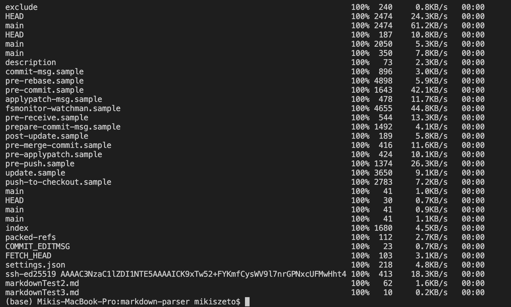

### 2. Show logging into ieng6 account and compiling and running the tests
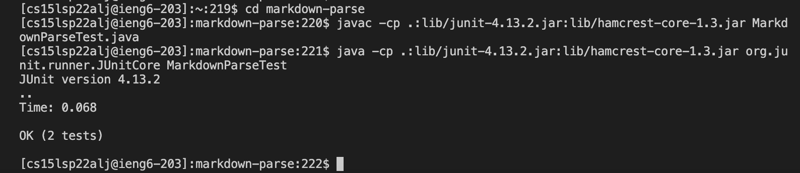

### 3. Show combining multiple commands to copy the whole directory and run the tests in one line
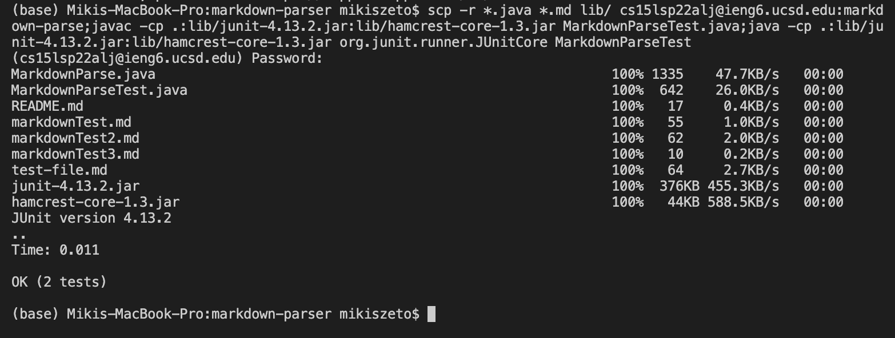

