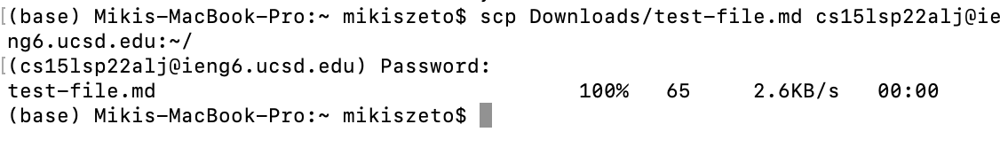

# Streamlining ssh Configuration
### Showing my `.ssh/config` file

### Showing the `ssh` command that logged me into my account

### Showing the `scp` command

# Setup Github Access from ieng6
### Showing where the public key is stored

### Showing where the private key is stored

 
### running git commands to commit and push
 `git commit`:
 
 `git push`:
 
 
### a link for the resulting commit
Please click [here](https://github.com/MikiiiST/markdown-parser/commit/fc2ac00a23baf867e3cdb0c9cf6324e942bcd6b4)

# Copy whole directories with scp -r
### Show copying the whole markdown-parse directory to ieng6 account

### Show logging into ieng6 account and compiling and running the tests

### Show combining multiple commands to copy the whole directory and run the tests in one line

