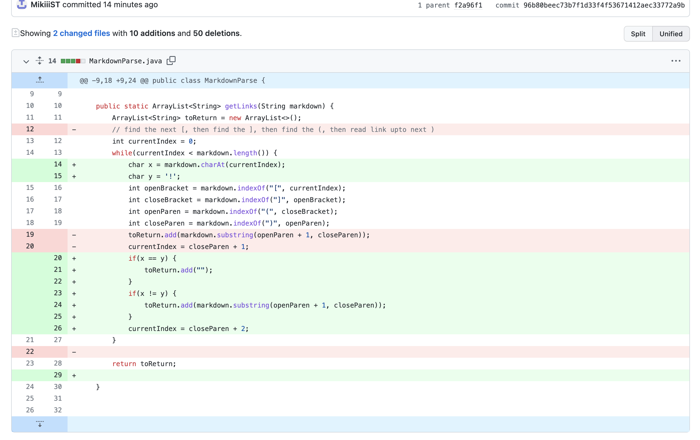
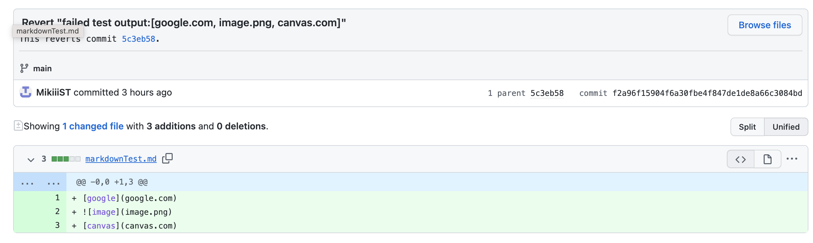
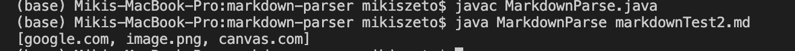

# Code Change 1: image reference
#### 1. Screenshot of the code change diff from Github 

Link to my corrected code is [here](https://github.com/MikiiiST/markdown-parser/commit/96b80beec73b7f1d33f4f53671412aec33772a9b)

#### 2. Link to the test file for a failure-inducing input
https://github.com/MikiiiST/markdown-parser/commit/f2a96f15904f6a30fbe4f847de1de8a66c3084bd

failure-induing input is shown below:

#### 3. Show the symptom of that failure-inducing input by showing the output of running the file at the command line for the version where it was failing 

#### 4. Describing the relationship between the bug, the symptom, and the failure-inducing input.
My failure-induing input, which attempts to add a link to an image, is shown above. However, links to images should not be incorporated in the output since images could not be shown. The symptom of this failed input is that it shows the link of the image, shown by the output `image.png`. I fixed the bug in the code that made this symptom, so now the new and corrected output disregards the image link.

