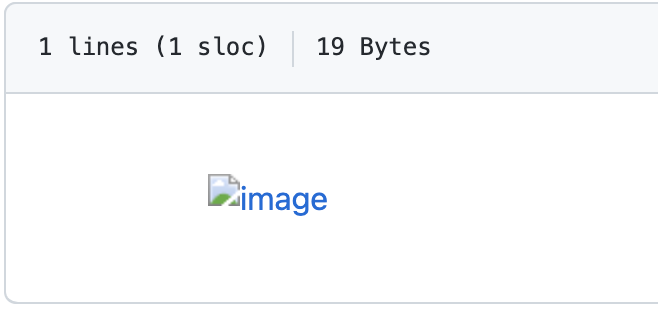
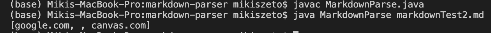
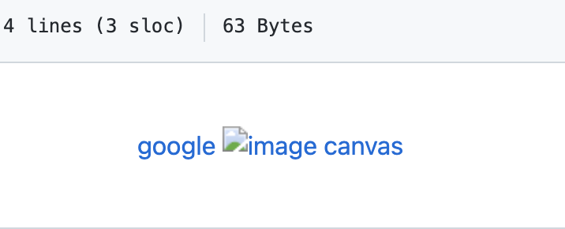
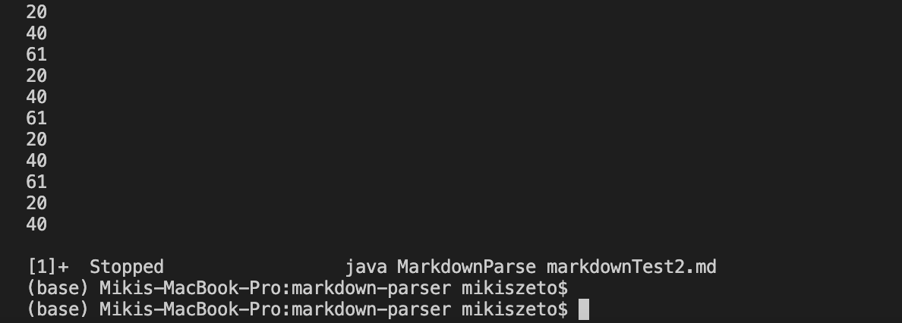
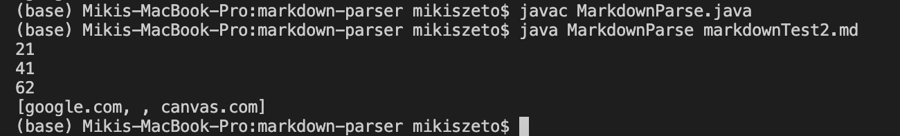
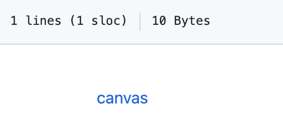
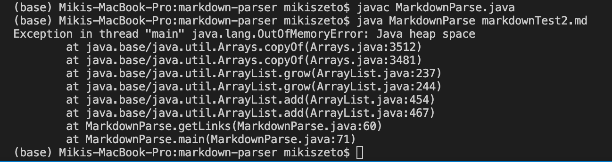
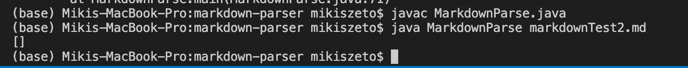

# Code Change 1: image reference
#### 1. Screenshot of the code change diff from Github 

Link to my corrected code is [here](https://github.com/MikiiiST/markdown-parser/commit/96b80beec73b7f1d33f4f53671412aec33772a9b)

#### 2. Link to the test file for a failure-inducing input
Please click [here](https://github.com/MikiiiST/cse15l-lab-reports/blob/main/lab3Test.md)

failure-induing input is shown below:

#### 3. Show the symptom of that failure-inducing input by showing the output of running the file at the command line 

#### 4. Describing the relationship between the bug, the symptom, and the failure-inducing input.
My failure-induing input, which attempts to add a link to an image, is shown above. However, links to images should not be incorporated in the output since images could not be shown. The symptom of this failed input is that it shows the link of the image, shown by the output `image.png`. I fixed the bug in the code that made this symptom, so now the new and corrected output disregards the image link.

New output:

# Code Change 2: infinite loop
#### 1. Screenshot of the code change diff from Github 

Link to my corrected code is [here](https://github.com/MikiiiST/markdown-parser/commit/96b80beec73b7f1d33f4f53671412aec33772a9b)

#### 2. Link to the test file for a failure-inducing input
Please click [here](https://github.com/MikiiiST/cse15l-lab-reports/blob/main/lab3Test2.md)

failure-induing input is shown below:

#### 3. Show the symptom of that failure-inducing input by showing the output of running the file at the command line

#### 4. Describing the relationship between the bug, the symptom, and the failure-inducing input.
Before I made changes to the code, there was a bug in the code that the symptom is whenever I ran my markdown file with the failure-inducing input, the code will goes to an infinite loop as shown my the repeated current index number. I figured I needed to change the code for current index. After I corrected the code, there was no more inifinite loop symptom. 

New output:

# Code Change 3: a file with no link
#### 1. Screenshot of the code change diff from Github 

Link to my corrected code is [here](https://github.com/MikiiiST/markdown-parser/commit/96b80beec73b7f1d33f4f53671412aec33772a9b)

#### 2. Link to the test file for a failure-inducing input
Please click [here](https://github.com/MikiiiST/cse15l-lab-reports/blob/main/lab3Test3.md)

failure-induing input is shown below:

The failed input was 
`[canvas]()`

#### 3. Show the symptom of that failure-inducing input by showing the output of running the file at the command line

#### 4. Describing the relationship between the bug, the symptom, and the failure-inducing input.
Before I made changes to the code, there was a bug in the code where the symptom is whenever I input a file with no link, the file wuold not run correct and the output would be an OutOfMemory error. I changed the code so that when there is no link provided, there would be no OutOfMemory error and the file could still run correctly. 

New output:

