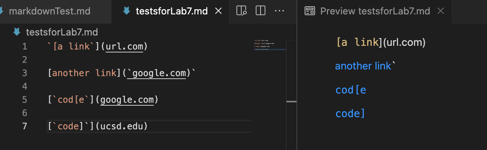

Link to my markdown-parse repository is [here](https://github.com/MikiiiST/markdown-parser)
Link to the markdown-parse repository I reviewed is [here](https://github.com/ayushs2725/markdown-parser)

# Snippet 1
### Test using my implementation:

1) Using VSCode preview, the test should produce

2) Showing the code in MarkdownParseTest.java for how I turned it into a test

3) The test I ran for snippet 1 passed, which is shown by the following message.

### Test using the reviewed implementation:
1) Using VSCode preview, the test should produce

2) Showing the code in MarkdownParseTest.java for how I turned it into a test

3) The test I ran for snippet 1 passed, which is shown by the following message.

# Snippet 2
### Test using my implementation:

1) Using VSCode preview, the test should produce

2) Showing the code in MarkdownParseTest.java for how I turned it into a test

3) The test I ran for snippet 2 failed. See below for the corresponding output and the specific part of the JUnit output that shows the test failure.

### Test using the reviewed implementation:
1) Using VSCode preview, the test should produce

2) Showing the code in MarkdownParseTest.java for how I turned it into a test

3) The test I ran for snippet 2 failed for the reviewed implementation. See below for the corresponding output and the specific part of the JUnit output that shows the test failure.

# Snippet 3
### Test using my implementation:

1) Using VSCode preview, the test should produce

2) Showing the code in MarkdownParseTest.java for how I turned it into a test

3) The test I ran for snippet 3 failed. See below for the corresponding output and the specific part of the JUnit output that shows the test failure.

### Test using the reviewed implementation:
1) Using VSCode preview, the test should produce

2) Showing the code in MarkdownParseTest.java for how I turned it into a test

3) The test I ran for snippet 3 failed for the reviewed implementation. See below for the corresponding output and the specific part of the JUnit output that shows the test failure.

# Answer the following questions
### Do you think there is a small (<10 lines) code change that will make your program work for snippet 1 and all related cases that use inline code with backticks? If yes, describe the code change. If not, describe why it would be a more involved change.
I think a small code change can make the program work for snippet 1 and other related cases. The code change would be making sure the code read everything beginning at open parentheses and end at closing parentheses. For example, we can check for the char '(' and ')' and read everything inside it. This can ensure the program correctly reads the link inside open and closing parentheses even if there are backticks.

### Do you think there is a small (<10 lines) code change that will make your program work for snippet 2 and all related cases that nest parentheses, brackets, and escaped brackets? If yes, describe the code change. If not, describe why it would be a more involved change.
I think the code change to solve snippet 2 would be a more involved change. We need to check the position of the last closing bracket. If there are more than one closing bracket, I would use a for loop to loop through the line and store the position of the last closing bracket. The I would store the position of the open parentheses that appear after the closing bracket. If there are multiple closing parentheses, I would use a for loop to find the position of the last open parentheses. Then I would read everything between the open parentheses and final closing parentheses.

### Do you think there is a small (<10 lines) code change that will make your program work for snippet 3 and all related cases that have newlines in brackets and parentheses? If yes, describe the code change. If not, describe why it would be a more involved change.
I think the code change to solve snippet 3 would be a more involved change. I would need to make sure that my code can handle situations where there are line breaks. Also, I need to make sure that my code can read without open or closing parentheses. One way to solve the situation can be to look for the string ".com" and make sure the program ends there. Also, I need to make sure my code knows when to stop when there are empty spaces before the closing parentheses. 

## If your code already works on some/all test cases, include an explanation of what were the code changes that allowed the tests to pass.
My code works for some test cases. It passed the tests for snippet 1, but failed snippet 2 and snippet 3. The code change that allowed the tests to pass for snippet 1 is to make sure my code finds the correct position of open parentheses and closing parentheses and the code will read everything between them. This way, my code can read the link correctly. 
