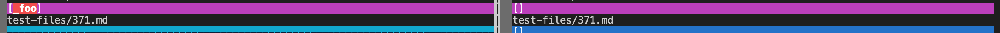
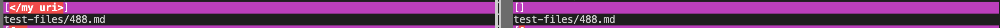

### Two tests with different answers when using my implementation and the provided implementation.

### How you found the tests with different results
I found the different tests using vimdiff on the results of running a bash for loop then check for different tests manually.

### Provide a link to the test-file with different-results
[Please click here for the first test](https://github.com/nidhidhamnani/markdown-parser/blob/main/test-files/371.html.test)
[Please click here for the second test](https://github.com/nidhidhamnani/markdown-parser/blob/main/test-files/488.html.test)
[Here to view the whole test-file](https://github.com/nidhidhamnani/markdown-parser/tree/main/test-files)

### Test 1
The provided implementation is correct because this test case should not produce a link.
Both actual outputs is shown below:

Expected outputs are:

The bug in my implementation is that the position of open and closing parentheses are not correctly found. My implementation only checks for the first and last open and closing parentheses, so it is not correct. 

### Test 1
The provided implementation is correct because this test case should not produce a link.
Both actual outputs is shown below:

Expected outputs are:

The bug in my implementation is that the position of open and closing parentheses are not correctly found. My implementation only checks for the first and last open and closing parentheses, so it is not correct. 

