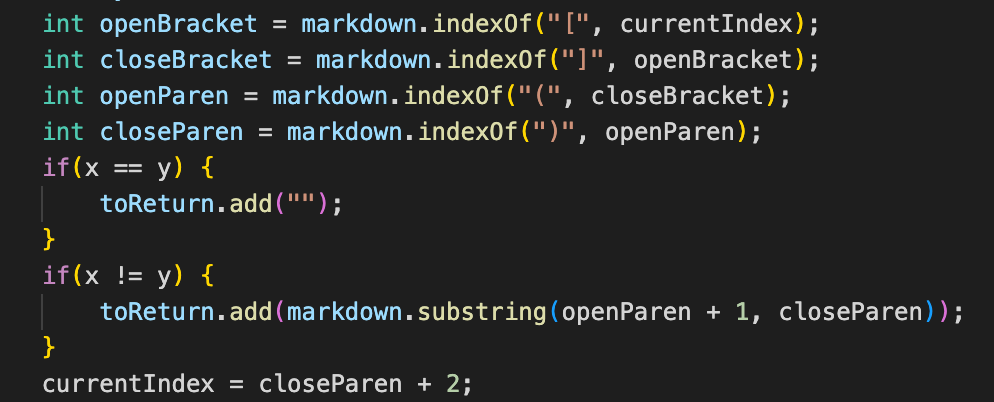

### Two tests with different answers when using my implementation and the provided implementation.
Test 1:

Test 2:

### How you found the tests with different results
I found the different tests using vimdiff on the results of running a bash for loop then check for different tests manually.

### Provide a link to the test-file with different-results
[Click here for the first test](https://github.com/nidhidhamnani/markdown-parser/blob/main/test-files/371.html.test)  
[Click here for the second test](https://github.com/nidhidhamnani/markdown-parser/blob/main/test-files/488.html.test)  
[Click here to view the whole test-file](https://github.com/nidhidhamnani/markdown-parser/tree/main/test-files)  

### Test 1
Both actual outputs are shown below:

Expected output is:

Neither implementation is correct. Using VScode preview, the expected output is (foo). However both implementations did not produce the expected output.
 
The bug in my implementation is that the position of open parentheses is not correctly found. My implementation checks for the first and last open and closing parentheses based on open and closing brackets. Since the test doesn't contain open and closing brackets, the position of open parentheses is wrong, leading to wrong output.

Code snippet that needs to be changed is shown below:
My implementation:

The provided implementation:

### Test 2
Both actual outputs is shown below:

Expected output is:

Neither implementation is correct. Using VScode preview, the expected output is a link. However both implementations did not produce the expected output.
 
The bug in my implementation is that the position of open abd closing parentheses are not correctly found. My implementation checks for the first and last open and closing parentheses based on open and closing brackets. Since the test doesn't contain open and closing brackets, the position of open and closing parentheses are wrong, leading to wrong output.

Code snippet that needs to be changed is shown below:
My implementation:

The provided implementation:

