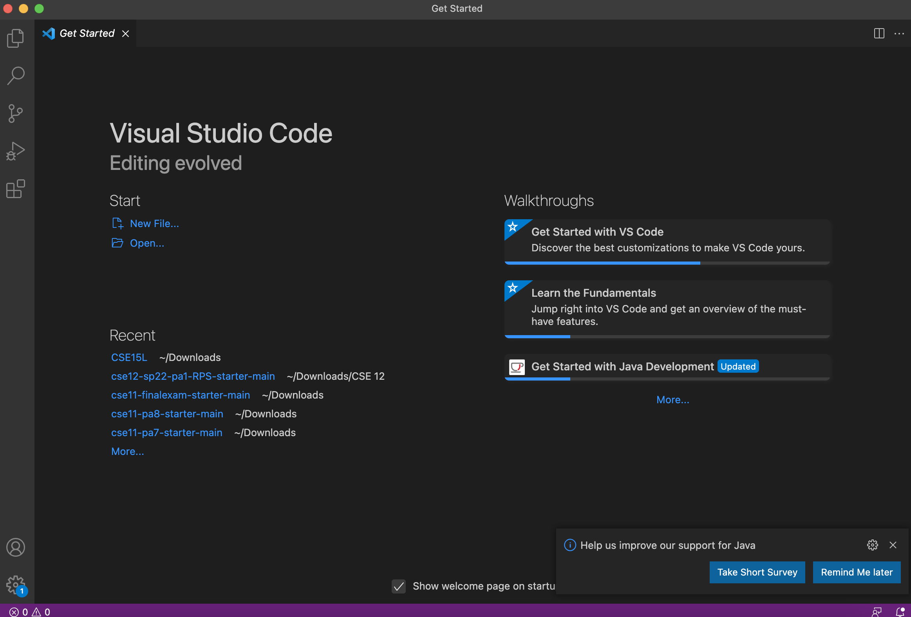
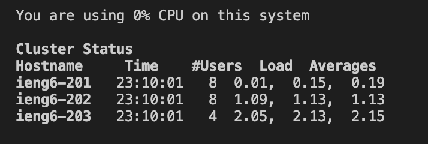
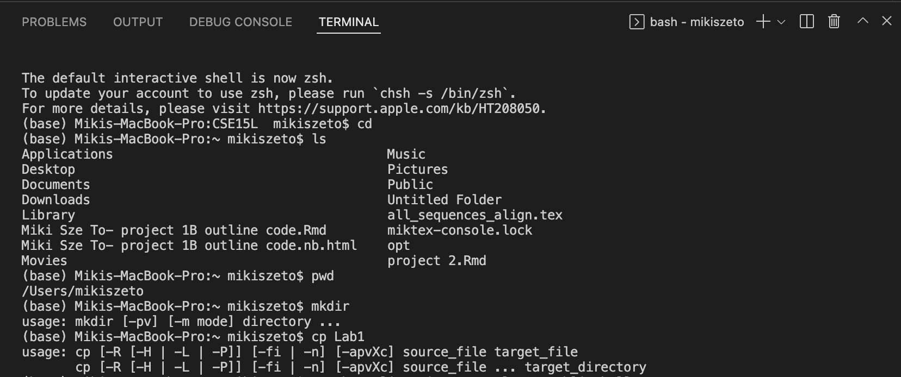
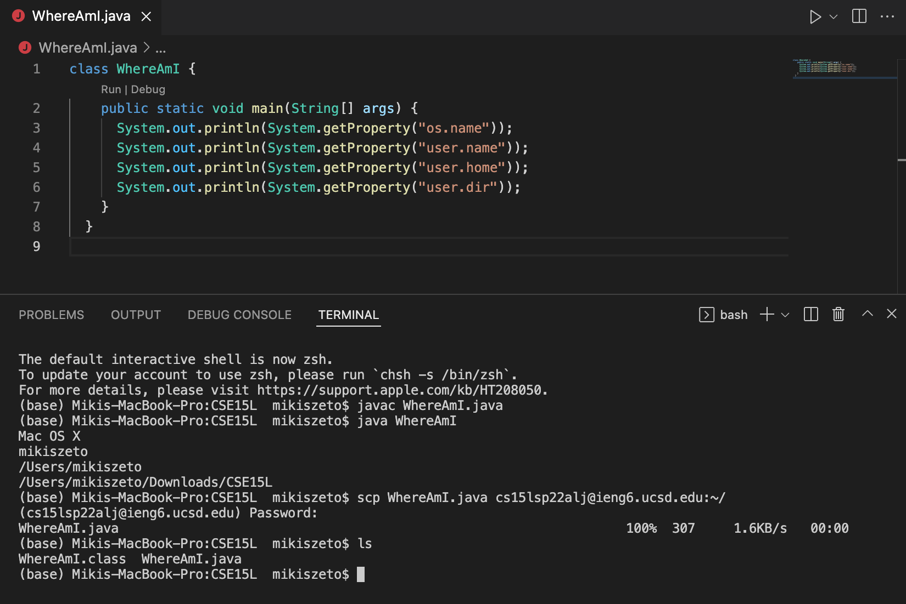
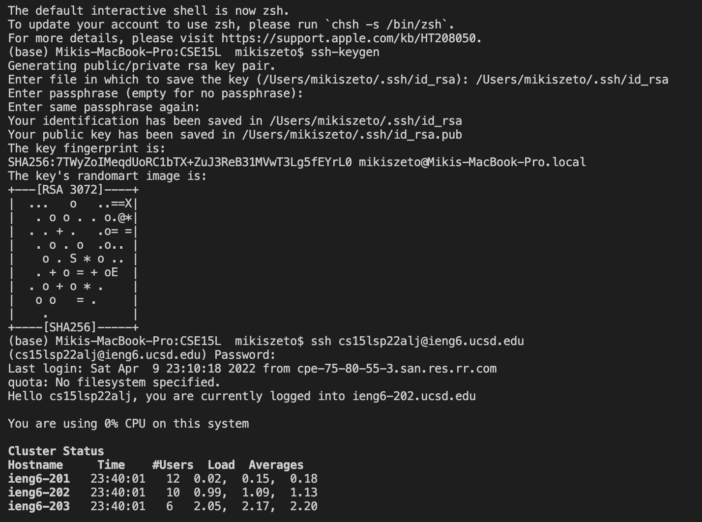
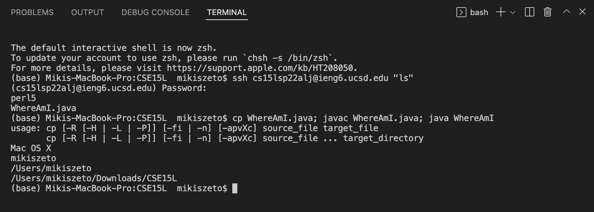

Step 1: Install Visual Studio Code

To install VS Code, I went to this website [here](https://code.visualstudio.com/). This website contains information on how to install and download VS code on your machaine. Once VS code is successfully installed and I opened VS code, I saw see this following image on VS code. 

Step 2: Remotely Connecting

This step allows me to connect my machine to a remote computer and do work, such as coding, there. 

- If you have Windows, the first step is to download a program called OpenSSH from [here](https://docs.microsoft.com/en-us/windows-server/administration/openssh/openssh_install_firstuse). This programs allows you to connect other computers to your computer. I have a Mac, so I did not dowload the program.
- I found out my course specific account for CSE15L [here](https://sdacs.ucsd.edu/~icc/index.php).
- I opened a terminal in VS Code. Typed in the following command: $ ssh cs15lsp22zz@ieng6.ucsd.edu. I replaced "zz" with my personal course specific account. It is my first time connecting to the server, so I saw the following "The authenticity of host 'ieng6.ucsd.edu (128.54.70.227)' can't be established." "Are you sure you want to continue connecting (yes/no/[fingerprint])?" This message is expected, so I typed Yes. 
- I typed Yes and entered my password. I saw the the following image
Now my computer is connected to a computer in the CSE basement! My computer is the *client* and the computer in the basement is the *server*. 

Step 3: Trying Some Commands

I ran some commands in a terminal in VS Code. 
I tried various commands such as cd ~, cd, ls, ls -lat, ls -a, pwd, mkdir, and cp. 
- cd ~: changes directory to home directory
- cd: changes directory
- ls: lists all directories and files of a specific directory
- ls -lat: lists all directories and files in long listing format
- ls -a: lsits all directories and files including hidden files
- pwd: prints the path to the current working directory
- mkdir: makes a directory
- cp: copy, can copy files.

Step 4: Moving Files with scp

This step allows me to use the *scp* command to securely copy files from my computer to a remote computer. To try out this command, I took the following steps: 
- I created a file called WhereAmI.java
- Put the following in the file

class WhereAmI {
  public static void main(String[] args) {
    System.out.println(System.getProperty("os.name"));
    System.out.println(System.getProperty("user.name"));
    System.out.println(System.getProperty("user.home"));
    System.out.println(System.getProperty("user.dir"));
  }
}
- Ran javac and java in the terminal
- Ran this command: scp WhereAmI.java cs15lsp22zz@ieng6.ucsd.edu:~/ but replaced "zz" with my personal account
- Entered the password for my account
- Used *ls* command
Now the file is copied and can be ran on the remote computer 

Step 5: Setting an SSH Key

This step allows me to use a program called ssh-keygen to avoid re-entering my password everytime I use ssh and scp commands from my computer to the server. The program creates a public key file and private key file. I will copy the public key file to a specific location on the server and the private key in a particular location on my computer. Then the ssh command can use the pair of files in place of my password. I used the following steps:
- $ ssh-keygen on my computer
- Entered the file in which to save the key 
- Enter and re-entered the same passphrase
- $ ssh cs15lsp22zz@ieng6.ucsd.edu replaced "zz" with my account
- Entered password
- $ mkdir .ssh
- $ scp /Users/<user-name>/.ssh/id_rsa.pub cs15lsp22zz@ieng6.ucsd.edu:~/.ssh/authorized_keys
Now I can use ssh and scp commands without re-entering my password everytime!

  
Step 6: Optimizing Remote Running

This step allows me to try to find a way to optimize how to make local edits on my computer and copy it to remote server and run it.
- I wrote a command in quotes after ssh command to directly run on the server
- I used semicolons to run multiple commands on a same line

 
 

